## Module 3 smart-sales-docs

## 1. Get Started

### Verify You've Created a Local Project Virtual Environment

Create a virtual environment:
```shell
python -m venv .venv
```

Verify a new folder named .venv is available. You must be able to see hidden files and folders on your machine. 

### Activate the Virtual Environment (Always)

Every time you open a new terminal and work on the project, be sure to activate the project virtual environment. 

In Windows / PowerShell:

```shell
.\.venv\Scripts\activate
```
### Verify You've Installed All Required Packages (As Needed)

With the virtual environment activated, install the most current versions of the required packages which should be listed in your requirements.txt:

```shell
python -m pip install --upgrade -r requirements.txt
```
-----

## 2. Implement and Test General DataScrubber Class

### Run the Test Script

In your VS Code terminal, with your local project virtual environment **active** (and all necessary packages installed),
run the test script with the following command. 

In Windows / PowerShell:

```shell
py tests\test_data_scrubber.py
```

The first time you run it, all tests will not pass correctly. 

### Finish DataScrubber Until All Tests Pass Successfully

Edit your scripts\data_scrubber.py file to complete the TODO actions. Verify by running the test script. 
Once all tests pass, you are ready to use the Data Scrubber in your data_prep.py (or other data preparation script). 

-----

## 3. Complete all Data Preparation

For this step, use pandas and the DataScrubber class as needed to clean and prepare each of the raw data files. 

We have an example data_prep.py file provided that illustrates common cleaning tasks and how to use the DataScrubber class. 

Right now, all files are cleaned in a single scripts/data_prep.py file, but you may find it better to have smaller files, maybe one per raw data table. 

Given the examples and the work done previously, read, clean, and preprocess all your raw data files and save the prepared versions in the data/prepared folder. 

We recommand a naming scheme - following this will make future assignments a bit easier as we will use these file names and locations, 
however, you are welcome to vary the names. Your future scripts will need to correctly reflect your folder and file naming conventions. 
Changing is harder and better for learning. If new, please follow our folder and file naming conventions exactly.

If your file is in the scripts folder, with a name of data_prep.py, you can run it with the appropriate command from a VS Code terminal open in the root project folder:

In Windows / PowerShell:

```shell
py scripts\data_prep.py
```
### P4 Create and Populate DW
# Plan Data Warehouse
  Design Schema- Star
  Fact Table- Sales
  Dimension Tables- Products and Customers
  Upload CSV files to DB for SQLite
  Create smart_sales.db file within data/dw
# Define, Create, Populate DW Schema
  Create etl_to_dw.py script
  Implement script, debug & run

# Validate Data Warehouse
# Document & Submit Work

### P5 Cross-Platform Reporting with Power BI
## 1 Install SQLite ODBC Driver and configure DSN to link Power BI to database
## 2 In Power BI: Get Data > Select ODBC > Choose SQLite DSN, load customer, product & sales tables
## 3 In Power BI: Open Transform Data > Advanced Editor > add SQL code
    "SELECT customer.CustomerID, customer.Name, SUM(sale.SaleAmount) AS total_revenue FROM customer INNER JOIN sale ON customer.CustomerID = sale.CustomerID GROUP BY customer.CustomerID, customer.Name#(lf)"
    Name the table Top Customers
## 4 Load & review results

## 5 Slice, Dice Drilldown
# Add a date range slicer
    Add the Slicer visual, drag SaleDate column into Slicer
    With Date Field selected, it should let you toggle the Between dates to filter the range
    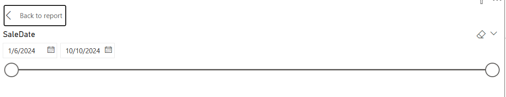
      ***Use ChatGPT notes to change field from TEXT to DATE so the slicer will allow "between"
# Create a matrix visual for sales by product & region
    Add the Matrix visual, drag Product into Rows, drag Region into Columns, Drag SaleAmount into Values
    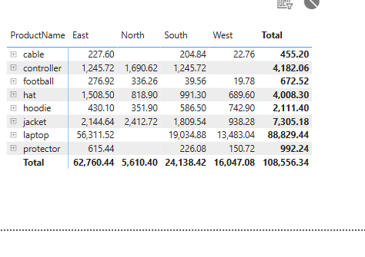
# Enable drill-through to explore sales by year, quarter, month
    Add new visual and select Drillthrough. Drag SaleDate to Field
    Drag Year, Quarter, Month to Drillthrough fields
    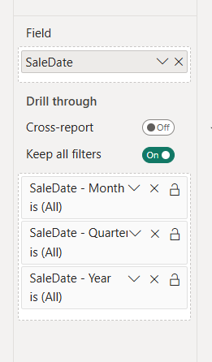

## 6 Create Interactive Visualizations
# Create bar chart for Top Customers
  Add visual for Stacked Bar Chart. Choose Top Customers data 
  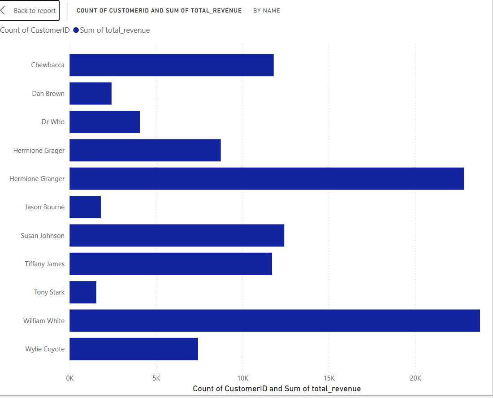

# Create line chart for Sales Trends
  Add visual for Line Chart. I chose Category, Sale Amount & Quarter
  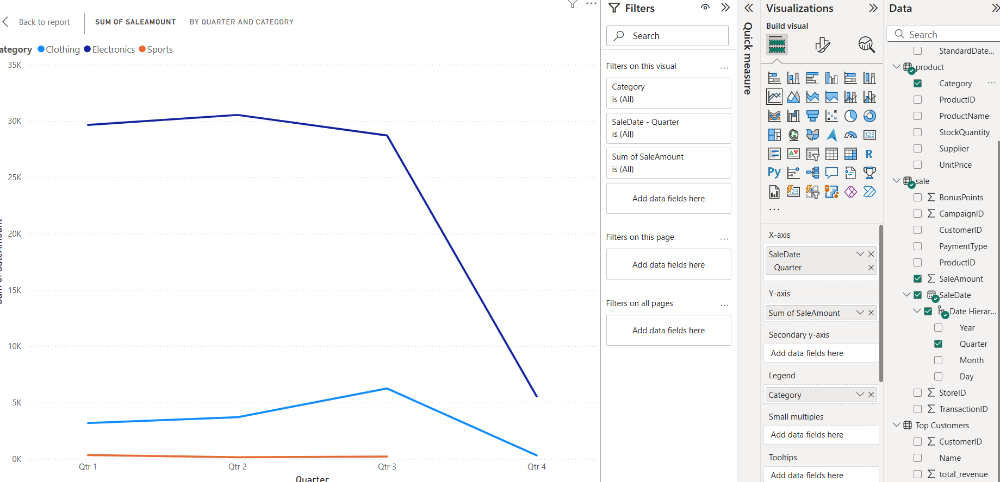

# Add a slicer for product categories
  Add visual for Slicer. I used Category and Product Name
  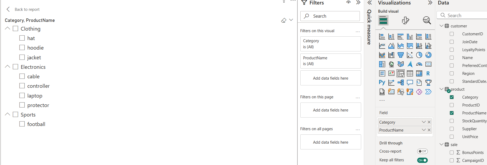

## Screenshot of Power BI Model View
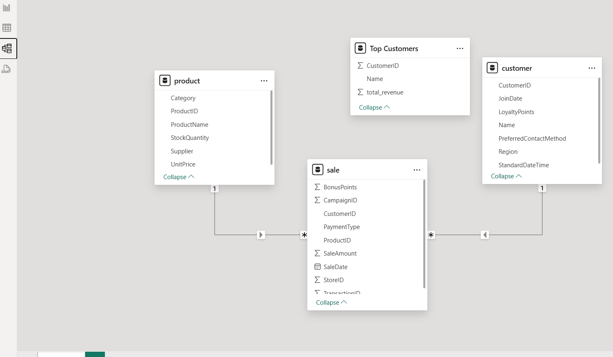

## Screenshot of Query Results
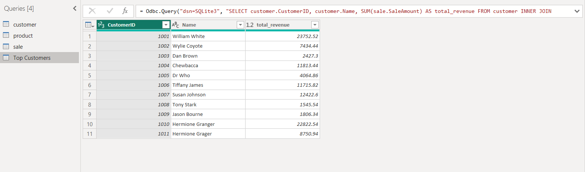

## Screenshot of Final Dashboard/Charts
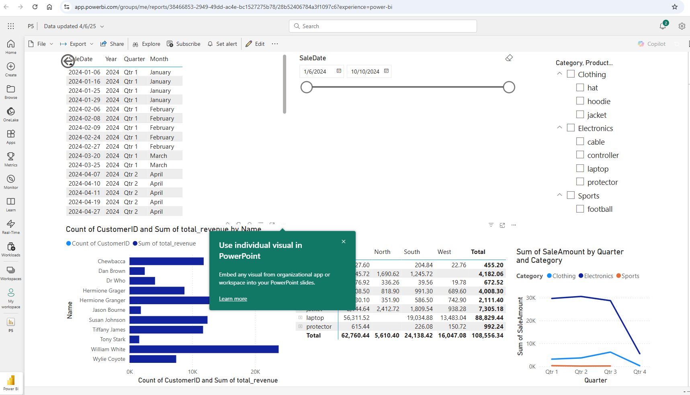

In VS Code, activate .venv   .\.venv\Scripts\activate
git add .
git commit -m "update ReadMe, add PowerBI screenshots"
git push

### P6. BI Insights and Storytelling
## Objectives
  -Analyze data using OLAP, slicing, dicing, and drilldown techniques to identify business insights.
  -Design a clear business question and define the data and metrics required to address it.
  -Use Python (or an alternate tool) to implement OLAP-style queries and analysis.
  -Present insights using clear visualizations and explain the business implications.
  -Describe the logic, process, and challenges behind your OLAP implementation.

## Task 1- Choose a Specific Business Goal
  Script olap_cubing.py to build the cube
  Example 1: Sales by Day   use script in olap_goal_sales_by_day.py
  Example 2: Top Product by Day  use script in olap_goal_top_product_by_day.py
  Goal: Product Top Sellers by Store use script in olap_goal_product_top_sellers_by_qty.py

## Task 2- Plan your OLAP analysis
  Choose data source: prebuilt cube, data warehouse, prepared data
  Plan the workflow: Tables, columns, scripts, output names

## Task 3- Implement OLAP Analysis
  Select and configure tools- Python, Tableau, PowerBI
  Explain choice and describe workflow

  Perform Data Analysis: Slicing, Dicing, Drilldown

  Test and Validate
    Test OLAP queries to make sure they return reasonable results
    Validate the analysis is actionable and meaningful to the business
    Double-check calculations to verify they make sense
    Compare totals from the cube and data warehouse for consistency

## Task 4- Present Results and Visualizations
  Options: Bar Charts, Line Charts, Pivot tables 

## Task 5- Document and Submit Work
# Summary of Project
  Business Goal
  Data Source
  Tools
  Workflow & Logic
  Results
  Suggested Business Action
  Challenges

In VS Code, activate .venv   .\.venv\Scripts\activate
git add .
git commit -m "update ReadMe, add PowerBI screenshots"
git push

Visualizations:
Bar Graph created for Total Sales by Day of the Week (result of olap_goal_sales_by_day.py)
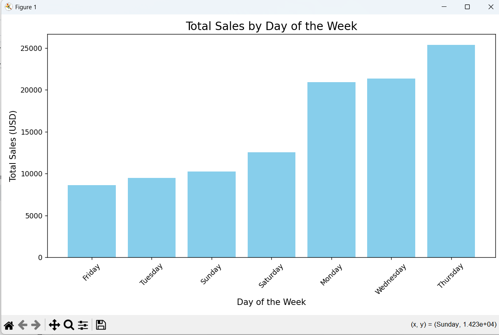

Stacked Bar Graph created for Total Sales by Day of the Week and Product (result of olap_goal_top_product_by_day.py)
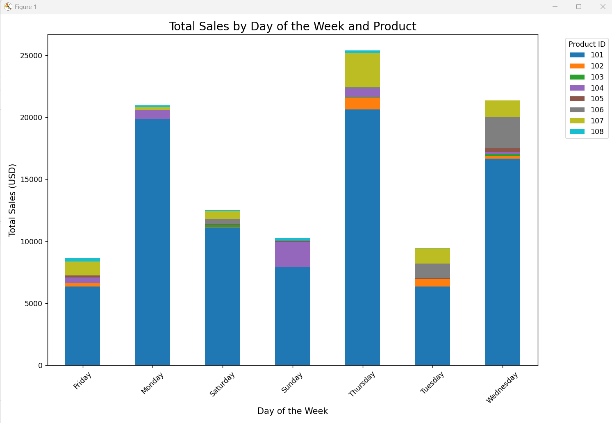

HeatMap created for Transaction Volume by Product Name and Store (result of olap_goal_product_top_sellers_by_qty.py)
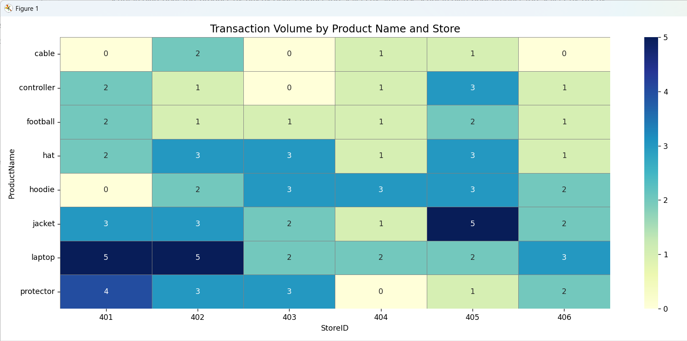
  
## P7 Custom BI Project
# Objectives
  Design and implement a custom BI project to answer a defined business question.
  Evaluate the ethical implications of using AI and automated decision-making in BI.
  Present clear, actionable insights through effective visualizations and narratives.
  Document your process and explain key challenges and decisions.

# Workflow
  Define - Choose a business goal and data set.
  Develop - Create a BI solution using the tools from previous modules.
  Analyze - Generate insights using slicing, dicing, and aggregations.
  Present - Summarize insights with clear visualizations and explanations.
  Reflect - Discuss the challenges, limitations, and ethical considerations.

# My Goal
  Segmenting Customers for Marketing
  Show Total Spend, Purchase frequency, Recency, Category preferences

# My BI Solution
  Use Python to segment, aggregate, cluster

# Generate Insights and Create Visualizations

# Reflect on BI Ethics and AI
  The ethical implications around any BI project can have enormous impact on a business. 
  There are many laws and governances that would require a business to use ethical means to gather, store and manage
  their data. How that data is used by stakeholders is extremely impactful. 
  Using AI for BI and resulting decision-making must be done very carefully.
  A BI team must be sure they have used accurate data with no bias or skewed information.

### Document and Submit Work 
## Section 1. The Business Goal
  Segment Customers for Marketing

## Section 2. Data Source
  smart_sales.db

## Section 3. Tools Used
  Python, SQLite, numpy, pandas, seaborn, matplotlib, sklearn
  ChatGPT to assist with script building
  
## Section 4. Workflow & Logic
  Build a script to segment the customers and create visualizations around customer purchases

## Section 5. Results (narrative + visualizations)
  The results of my script segmented the customers and created a cluster. 
  Then it provided different types of visualizations to include pair plot, bar plot and scatter plot.
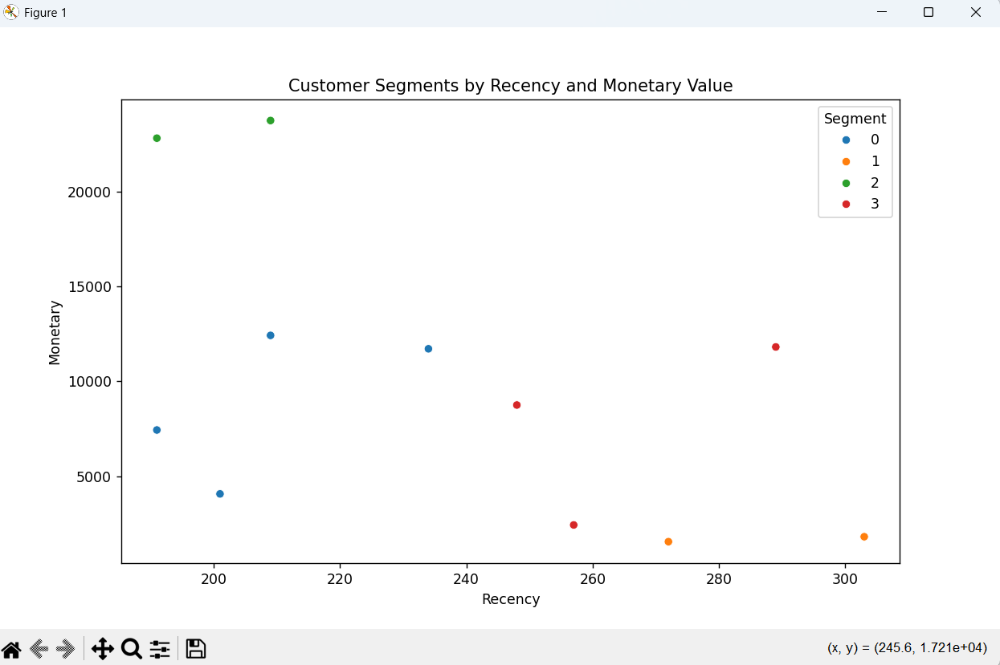 
This plot shows that Customer Segment 2 (in green) are high-dollar spenders and 
they have purchased these items recently. It also shows that our lower-dollar spenders 
have purchased less recently.

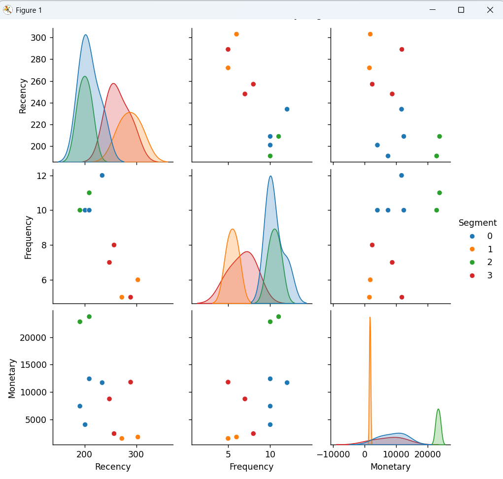
This visual brings in purchase frequency and gives a visual of this up 
against Recency and Monetary values. The highest frequency segement is Segment 0 (in blue).
While this segment are frequent buyers, they are not always big spenders. 

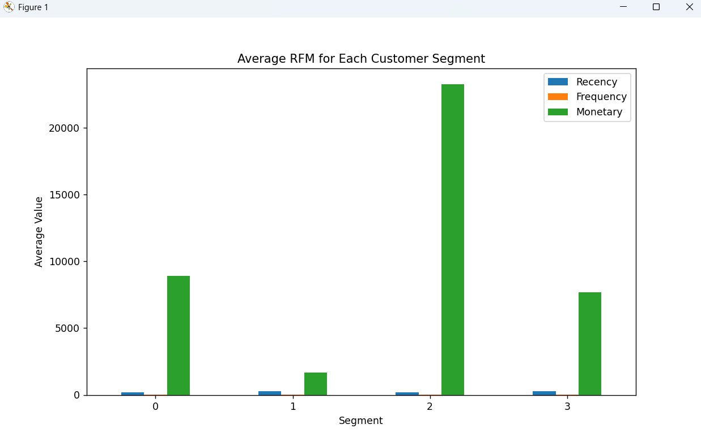
This bar graph shows Average RFM for Each Customer Segment. It also shows that Segment
2 are the largest spenders.

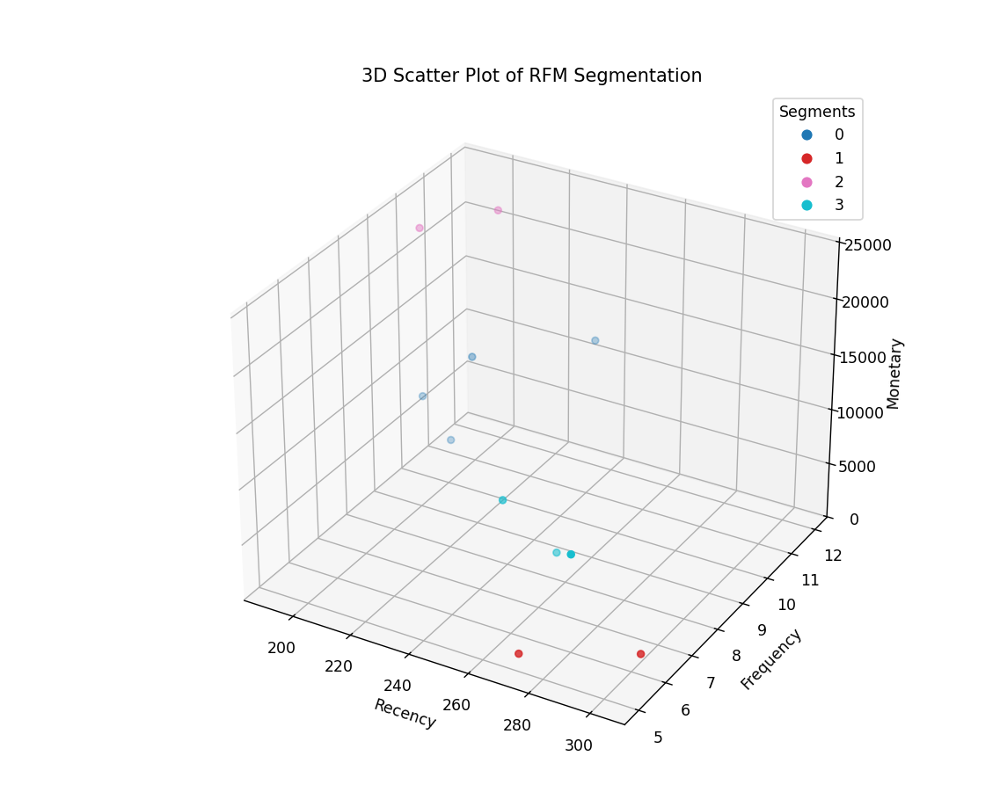
This is a 3D Scatter Plot that shows the RFM Segmentation from a different viewpoint.
It points out that our lowest frequency and less recent purchases are from Segment 1 (in red).

## Section 6. Suggested Business Action
  Based on the results of these visualizations, the business stakeholders have several 
  opportunities for continued growth. Marketing to frequent spenders is just as important
  as it is to lower-spend, less-frequent customers. The only difference is the marketing tools
  and approach you may want to take to reach out to each segment.

## Section 7. Challenges
  No major challenges with this project. Mainly making sure data points are clear and clean.
  Also making sure the visualizations truly told the story we wanted to feature.

## Section 8. Ethical Considerations
  As always, the BI team wants to make sure there is no bias in the data they present.
  Working with clean data that has been checked for missing fields, errors or other 
  issues that can skew outputs is imperitive.


# Final update to GitHub
In VS Code, activate .venv   .\.venv\Scripts\activate
git add .
git commit -m "update ReadMe, add PowerBI screenshots"
git push